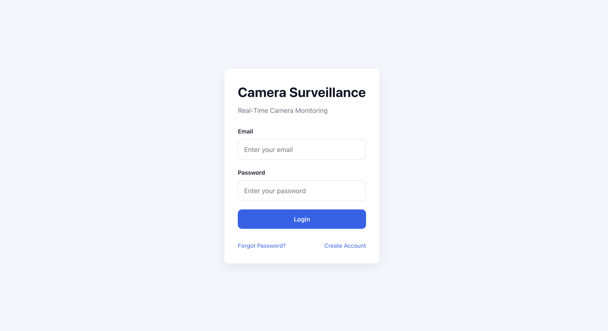
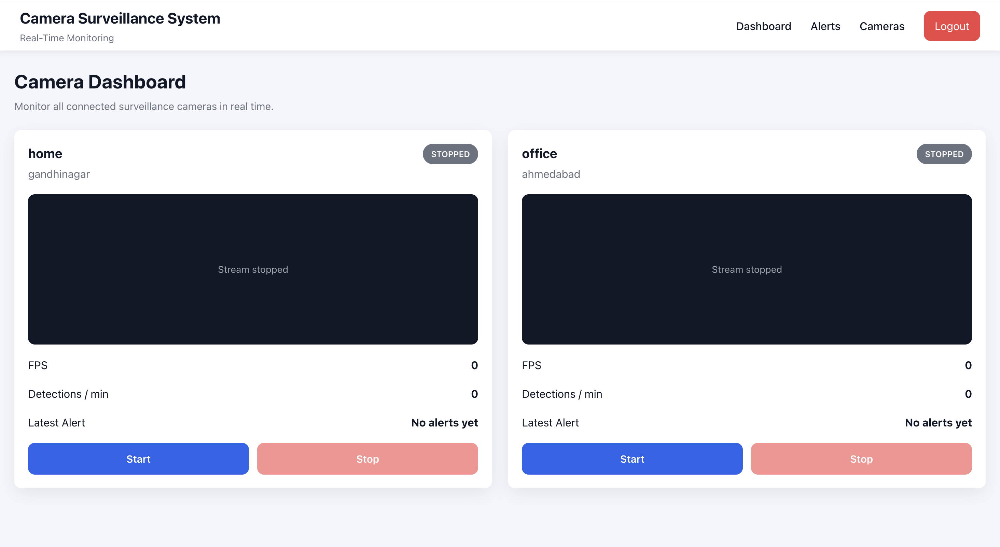
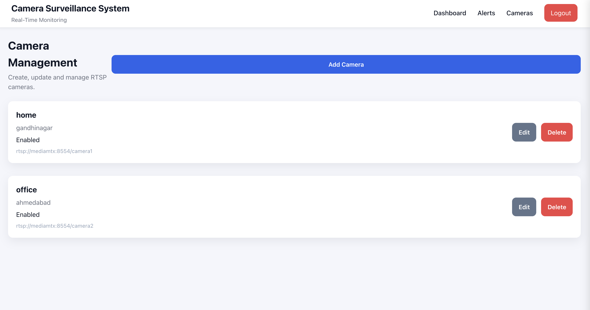
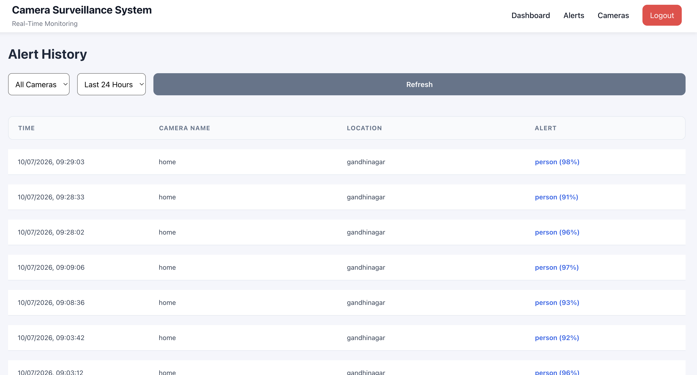

# Real-Time Camera Surveillance System

A distributed, event-driven surveillance platform for managing RTSP cameras, streaming live video with low latency using WebRTC, and delivering real-time detection alerts.

The system is designed using independent microservices where authentication, camera management, stream processing, messaging, persistence, and video streaming are separated into dedicated services. This architecture minimizes resource usage, enables horizontal scalability, and allows each component to evolve independently.

---

## Screenshots

### Login



### Dashboard


### Live Camera Streaming



### Camera Management



### Alerts



---

# Demo

A walkthrough of the live Stream is available below.

🎥 **Project Demo:** [Watch Demo](docs/demo/surveillance-demo.mp4)

---

# Architecture

```text
                                   +-------------------------+
                                   |     React Frontend      |
                                   +-------------------------+
                                              │
                                   REST APIs + WebSocket
                                              │
                                              ▼
                              +-------------------------------+
                              |        Bun + Hono API         |
                              +-------------------------------+
                               │            │              │
                               │            │              │
                               ▼            ▼              ▼
                         PostgreSQL       Redis       RabbitMQ
                               ▲                          ▲
                               │                          │
                     Users, Cameras, Alerts     Camera Commands
                                                Status Events
                                                Alert Events
                                                       │
                                                       ▼
                                   +---------------------------+
                                   |         Go Worker         |
                                   +---------------------------+
                                      │                   │
                                      │                   │
                               RTSP Frame Decode    RTSP Publisher
                                      │                   │
                                      ▼                   ▼
                                   FFmpeg             MediaMTX
                                      ▲
                                      │
                             RTSP Cameras / Demo Streams
                                      │
                                      ▼
                               Browser (WebRTC)
```

---

# Technology Stack

## Frontend

* React
* TypeScript
* Vite
* CSS Modules

## API Service

* Bun
* Hono
* Prisma ORM
* PostgreSQL
* Redis
* JWT Authentication

## Worker Service

* Go
* FFmpeg
* MediaMTX

## Messaging

* RabbitMQ

## Infrastructure

* Docker
* Docker Compose

---

# Core Features

## Authentication

* JWT-based authentication
* User registration and login
* Protected API routes
* Password hashing using bcrypt
* Email verification using OTP

### OTP Verification

User registration requires email verification through a One-Time Password (OTP).

The verification flow is implemented using Redis.

1. User requests registration.
2. A secure OTP is generated.
3. OTP is stored in Redis with a configurable TTL.
4. OTP is delivered using SMTP email.
5. User submits the OTP.
6. Redis validates the OTP.
7. User account is created after successful verification.

Using Redis provides:

* Automatic expiration through TTL
* Fast in-memory lookups
* No manual cleanup jobs
* Protection against stale verification codes

---

## Camera Management

Users can manage their personal camera library.

Supported operations include:

* Register RTSP cameras
* Update camera information
* Delete cameras
* Enable or disable cameras

Each camera stores:

* RTSP URL
* Camera name
* Location
* Enabled status

---

## Live Streaming

The platform supports low-latency browser streaming using WebRTC.

Streaming pipeline:

```
RTSP Camera
      │
      ▼
   FFmpeg
      │
      ▼
 MediaMTX
      │
      ▼
  WebRTC
      │
      ▼
 Browser
```

Features include:

* RTSP ingestion
* Browser playback using WebRTC
* Live FPS updates
* Camera status updates
* Independent camera lifecycle

Supported camera states:

* Connecting
* Live
* Stopped
* Error

---

## Real-Time Alerts

Detection alerts are delivered instantly through WebSockets.

Features include:

* Live alert notifications
* Alert history
* Camera filtering
* Time range filtering
* Cursor-based pagination
* Automatic UI updates without polling

---

# Design Highlights

## Single Decode, Multiple Viewers

The platform guarantees **one processing pipeline per active physical camera**.

A single worker session performs RTSP decoding, processing, and stream publishing.

Multiple users can simultaneously watch the same camera without creating additional decoding or inference pipelines.

This significantly reduces CPU and memory usage while allowing unlimited viewers for the same stream.

---

## Concurrent Multi-Camera Streaming

Users can monitor multiple cameras simultaneously.

Each active camera runs inside its own isolated worker session, allowing:

* Parallel camera processing
* Independent start and stop operations
* Failure isolation between streams
* Better utilization of multi-core systems

Stopping one camera never interrupts any other active stream.

---

## Event-Driven Architecture

Services communicate asynchronously through RabbitMQ.

Published events include:

* Camera Start
* Camera Stop
* Camera Status
* Detection Alerts

The API and Worker remain completely decoupled, making it easy to scale processing independently from client traffic.

---

## Real-Time Communication

The frontend maintains a persistent WebSocket connection.

The API immediately pushes:

* Camera status changes
* Detection alerts
* FPS updates

No client-side polling is required, reducing unnecessary API requests and improving responsiveness.

---

## User-Scoped Alert History

Detection alerts are permanently stored in PostgreSQL.

Alert history belongs to the **user-camera relationship**, not the active stream.

If a user removes a camera from their library and later adds the same physical camera again, previously generated alerts remain available.

Users cannot access alerts generated for cameras owned by other users, ensuring complete data isolation.

---

## Cursor-Based Pagination

Alert history uses **cursor-based pagination** instead of traditional offset pagination.

Benefits include:

* Consistent performance on large datasets
* No duplicate or skipped records while new alerts are inserted
* Efficient infinite scrolling
* Better scalability for continuously growing alert history

---

## Pluggable Detection Pipeline

The worker is built around a detector abstraction.

The current implementation uses a mock detector that periodically emits person detection events, validating the complete processing pipeline:

* Event generation
* RabbitMQ messaging
* Database persistence
* WebSocket broadcasting
* Frontend updates

A production detection engine (such as YOLOv8) can be integrated by implementing the detector interface without changing the surrounding architecture.

---

## Scalable Architecture

The platform is designed with horizontal scalability in mind.

* Stateless API instances can be replicated behind a load balancer.
* Worker instances process cameras independently.
* Camera processing is independent of connected viewers.
* Multiple users share the same processed stream.
* RabbitMQ enables asynchronous communication between services.
* MediaMTX distributes a single published stream to multiple WebRTC clients.
* Independent camera sessions allow workload distribution across multiple workers in the future.

---

# Project Structure

```text
.
├── frontend/
│   ├── src/
│   ├── public/
│   └── Dockerfile
│
├── backend/
│   ├── api/
│   │   ├── controllers/
│   │   ├── services/
│   │   ├── repositories/
│   │   ├── routes/
│   │   ├── websocket/
│   │   ├── prisma/
│   │   └── Dockerfile
│   │
│   ├── worker/
│   │   ├── cmd/
│   │   ├── internal/
│   │   └── Dockerfile
│   │
│   └── messaging/
│       ├── events/
│       └── queues/
│
├── demo/
│   ├── test1.mp4
│   ├── test2.mp4
│   └── test3.mp4
│
├── docker-compose.yml
├── mediamtx.yml
└── README.md
```

---

# System Workflow

## User Authentication

1. User registers using email and password.
2. Backend generates a One-Time Password (OTP).
3. OTP is stored in Redis with a configurable TTL.
4. OTP is sent via email.
5. User submits the OTP.
6. Redis validates the OTP.
7. User account is created.
8. JWT Access and Refresh tokens are issued.

---

## Camera Registration

1. User registers an RTSP camera.
2. Camera metadata is stored in PostgreSQL.
3. Camera becomes available in the user's camera library.

---

## Starting a Camera

1. User clicks **Start**.
2. API validates camera ownership.
3. API publishes a **Camera Start** event to RabbitMQ.
4. A worker consumes the event.
5. The worker creates a dedicated camera session.
6. FFmpeg connects to the RTSP stream.
7. Frames are decoded.
8. The processed stream is published to MediaMTX.
9. Browser consumes the stream over WebRTC.

---

## Live Streaming

Unlike traditional implementations where every viewer creates a new decoding pipeline, this platform maintains a single processing pipeline for each active camera.

```
Camera

↓

Worker Session

↓

MediaMTX

↓

User A

User B

User C
```

Regardless of the number of viewers, only one worker processes the camera stream.

---

## Alert Processing

The detection pipeline generates person detection events.

The event flow is:

```
Worker

↓

RabbitMQ

↓

API

↓

PostgreSQL

↓

WebSocket

↓

Frontend
```

Alerts are immediately persisted before being broadcast to connected clients.

---

## Camera Stop

1. User requests to stop a camera.
2. API publishes a **Camera Stop** event.
3. Worker terminates the corresponding session.
4. MediaMTX closes the published stream.
5. Connected viewers receive updated camera status.

---

# Database Design

The platform uses PostgreSQL for persistent storage.

## users

Stores user authentication and account information.

## cameras

Stores physical camera information.

A physical camera can be shared across multiple users without creating duplicate camera records.

## user_cameras

Maps users to cameras while storing user-specific metadata such as:

* Display name
* Location
* Enabled state

This design allows multiple users to reference the same physical camera while maintaining independent configurations.

## alerts

Stores detection alerts.

Each alert is associated with:

* User
* Camera
* Detection timestamp
* Detection metadata

Alert history remains available even if a camera is temporarily removed from a user's library and added again later.

---

# Messaging

RabbitMQ is responsible for asynchronous communication between services.

## Published Events

### Camera Start

Starts a worker session.

### Camera Stop

Stops an active worker session.

### Camera Status

Broadcasts camera lifecycle updates.

### Detection Alert

Persists detection events and updates connected clients.

This architecture completely decouples the API from stream processing.

---

# Docker Services

The application is fully containerized.

Docker Compose starts the following services:

| Service       | Purpose                     |
| ------------- | --------------------------- |
| Frontend      | React application           |
| API           | REST API + WebSocket server |
| Worker        | Camera processing           |
| PostgreSQL    | Persistent storage          |
| Redis         | OTP storage with TTL        |
| RabbitMQ      | Event broker                |
| MediaMTX      | RTSP → WebRTC streaming     |
| Demo Camera 1 | Demo RTSP source            |
| Demo Camera 2 | Demo RTSP source            |
| Demo Camera 3 | Demo RTSP source            |

The complete platform can be started using a single command.

```bash
docker compose up --build
```

---

# Environment Variables

## API

```env
DATABASE_URL=

REDIS_URL=

RABBITMQ_URL=

JWT_ACCESS_SECRET=

JWT_REFRESH_SECRET=

SMTP_HOST=

SMTP_PORT=

SMTP_USER=

SMTP_PASS=

MEDIAMTX_API=

MEDIAMTX_WEBRTC=
```

---

## Worker

```env
RABBITMQ_URL=

MEDIAMTX_RTSP=

MEDIAMTX_WEBRTC=

MODEL_PATH=
```

---

## Frontend

```env
VITE_API_URL=

VITE_MEDIAMTX_WEBRTC=
```

---

# Running the Project

Clone the repository.

```bash
git clone <repository-url>
cd <repository-name>
```

Start every service.

```bash
docker compose up --build
```

Open the application.

```
Frontend
http://localhost:5173
```

---

# Future Improvements

* YOLOv8 based object detection
* Multi-class object detection
* GPU acceleration
* Video recording
* Camera health monitoring
* Automatic worker failover
* Horizontal worker autoscaling
* Kubernetes deployment
* Distributed RabbitMQ cluster
* Role-based access control
* Multi-region deployment
* Distributed object storage for recordings

---

# License

Copyright © 2026 Ushmay Patel.

All rights reserved.

This repository is provided for demonstration and evaluation purposes only. No part of this project may be copied, modified, distributed, or used without prior written permission from the author.